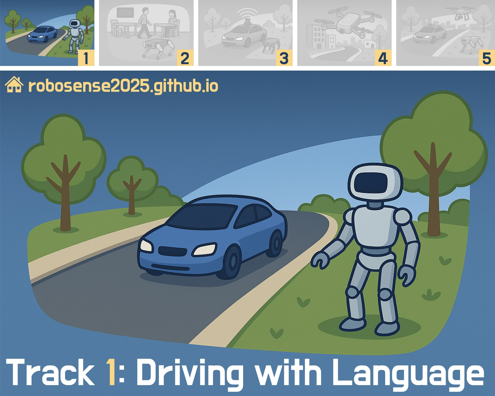
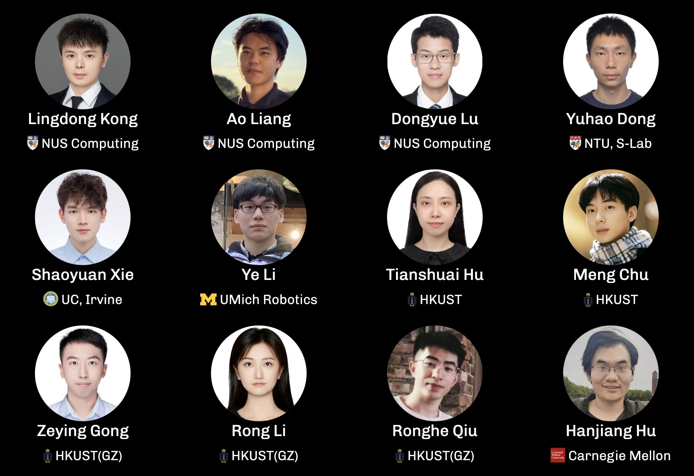
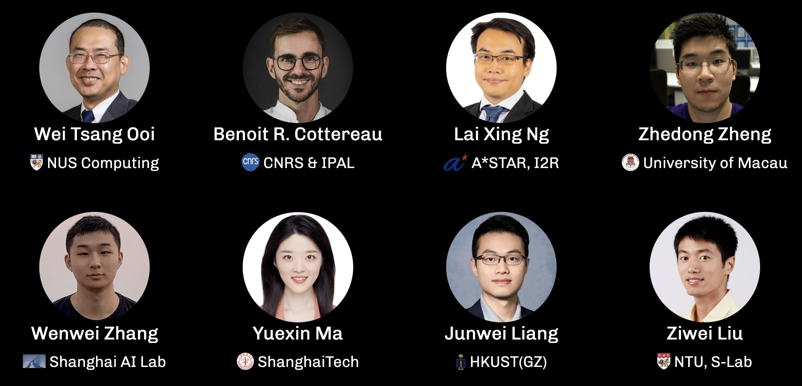

<h1 align="center">🤖 RoboSense Track 1:<br>Driving with Language</h1>


<div align="center">

**Official Baseline Implementation for [Track 1](https://robosense2025.github.io/track1)**

*Based on DriveBench -- "An Empirical Study from the Reliability, Data, and Metric Perspectives"*<br>(https://github.com/drive-bench/toolkit)

[](https://robosense2025.github.io/)
[](https://robosense2025.github.io/track1)
[](https://iros2025.org/)
[](https://www.codabench.org/competitions/9285/)
[](LICENSE)

**🏆 Prize Pool: $2,000 USD for Track 1 Winners**

<p align="center">
  
</p>

</div>

## Challenge Overview

**Track 1: Drive with Language** challenges participants to develop intelligent driving systems that can understand and act upon natural language instructions in dynamic driving environments. In an era where autonomous vehicles must interpret complex human commands, participants will design algorithms that bridge the gap between natural language understanding and driving actions. 

The challenge focuses on enabling autonomous agents to process commands involving perception, prediction, and planning. Submissions must address key challenges such as accurate scene perception, safe decision-making, and robustness against visual degradation in complex driving scenarios.


### 🎯 Objectives

This track evaluates the capability of VLMs to answer high-level driving questions in complex urban environments. Given questions including perception, prediction, and planning, and a multi-view camera input, participants are expected to answer the question given the visually corrupted images.

- **Perception**: Understand the scene and answer the question about the scene or objects in the scene.
- **Prediction**: Predict the future trajectory of objects in the scene.
- **Planning**: Plan the safe driving actions based on the objects in the scene.


## Competition Details

- **Venue**: IROS 2025, Hangzhou (Oct 19-25, 2025)
- **Registration**: [Google Form](https://docs.google.com/forms/d/e/1FAIpQLSdwfvk-NHdQh9-REiBLCjHMcyLT-sPCOCzJU-ux5jbcZLTkBg/viewform) (Open until Aug 15)
- **Contact**: robosense2025@gmail.com


### 🏆 **Awards**

| Prize | Award |
|:-|:-|
| 🥇 1st Place | $1000 + Certificate |
| 🥈 2nd Place | $600 + Certificate |
| 🥉 3rd Place | $400 + Certificate |
| 🌟 Innovation Award | Cash Award + Certificate |
| Participation | Certificate |


## 📊 Official Dataset

This track uses the **RoboSense Track 1 Drive with Language Dataset**, which is based on the **DriveLM and DriveBench** benchmarks that includes:

- **Multi-view Camera Input**: The input is a multi-view camera input from the nuScenes dataset.
- **Language Instruction**: The instruction is a natural language instruction, including perception, prediction, and planning.
- **Object Localization**: The object is referred to by the center point of the object in the scene.


### Dataset Statistics

| Driving Tasks | Num. of Questions | Question Types                   |
|:-|:-|:-|
| **Perception** | 361 | MCQs, VQA |
| **Prediction** | 522 | MCQs |
| **Planning** | 513 | VQA |

We further distinguish the VQA questions into two types:
- VQA<sub>obj</sub>: The question is about the object in the scene.
- VQA<sub>scene</sub>: The question is about the general scene.


### Baseline Performance (Phase 1)

We use [`Qwen2.5-VL-7B-Instruct`](https://huggingface.co/Qwen/Qwen2.5-VL-7B-Instruct) as the baseline model. The baseline performance is as follows:

| Task | Question Type | Accuracy (%) |
|:-|:-|:-|
| **Perception** | MCQ | 75.5 |
| | VQA<sub>obj</sub> | 29.2 |
| | VQA<sub>scene</sub> | 22.2 |
| **Prediction** | MCQ | 59.2|
| **Planning** | VQA<sub>obj</sub> | 29.6 |
| | VQA<sub>scene</sub> | 31.2 |
| **Average** | All Types | **42.5** |

## 🚀 Quick Start

We provide a simple demo to run the baseline model.

### 1. **Preparing conda env**

Assuming you have [conda](https://docs.conda.io/projects/conda/en/latest/user-guide/install/) installed, let's prepare a conda env:
```
conda create -n drive python=3.10
pip install -r requirements.txt
```

### 2. **Prepare the dataset**
First, convert the data format by running:

```bash
python convert_format.py <input_file> <output_file> 
```

The `input_file` can be downloaded from our [HuggingFace](https://huggingface.co/datasets/robosense/datasets/tree/main/track1-driving-with-language) page.

 You can also include temporal frames by adding the `--use-temporal` flag with `--num-frames <num_frames>`. The `convert_format.py` script requires the preparation of the [nuScenes](https://www.nuscenes.org/) dataset (~300GB). We will upload the subset of the nuScenes dataset in the future for convenience.

### 3. **Deploy**

We deploy the model using vLLM:

```bash
bash service.sh <GPU_NUM>
```

### 4. Evaluate the baseline

Simply run:

```bash
bash inference.sh
```

We also provide a UI to visualize the generated results to facilitate the development process:

```bash
python visual.py <result_file>
```

### 📦 Submission Packaging

The format should be the same as the **converted** format in Step 2, with the  filled `answer` field as shown below:
```json
[
  {
    "scene_token": "xxx",
    "frame_token": "xxx",
    "question": "What are the important objects in the current scene? Those objects will be considered for the future reasoning and driving decision.",
    "answer": "LLM Prediction here.",
    "category": "perception",
    "img_paths": {
      "CAM_FRONT": "data/nuscenes/samples/CAM_FRONT/n008-2018-09-18-14-35-12-0400__CAM_FRONT__1537295827412404.jpg",
      "CAM_FRONT_RIGHT": "data/nuscenes/samples/CAM_FRONT_RIGHT/n008-2018-09-18-14-35-12-0400__CAM_FRONT_RIGHT__1537295827420482.jpg",
      "CAM_FRONT_LEFT": "data/nuscenes/samples/CAM_FRONT_LEFT/n008-2018-09-18-14-35-12-0400__CAM_FRONT_LEFT__1537295827404799.jpg",
      "CAM_BACK": "data/nuscenes/samples/CAM_BACK/n008-2018-09-18-14-35-12-0400__CAM_BACK__1537295827437558.jpg",
      "CAM_BACK_RIGHT": "data/nuscenes/samples/CAM_BACK_RIGHT/n008-2018-09-18-14-35-12-0400__CAM_BACK_RIGHT__1537295827428113.jpg",
      "CAM_BACK_LEFT": "data/nuscenes/samples/CAM_BACK_LEFT/n008-2018-09-18-14-35-12-0400__CAM_BACK_LEFT__1537295827447405.jpg"
    }
  },
  {
    "scene_token": "xxx",
    "frame_token": "xxx",
    ...
```

The prediction file MUST be named as **`results.json`**. Then, zip the file for submission to [CodaBench](https://www.codabench.org/competitions/9285/) platform.

### ⏱ Evaluation Time

It takes around 5️⃣ minutes to finish the evaluation.


## 🎖️ Challenge Participation

### Submission Requirements
1. **Phase 1**: Submit results on clean test set with reproducible code
2. **Phase 2**: Submit results on corrupted test set with reproducible code
3. **Code**: Submit reproducible code with your final results
4. **Model**: Include trained model weights
5. **Report**: Technical report describing your approach

## 📏 Evaluation Metrics

Our benchmark uses the following metrics: **Accuracy** and **LLM Score**.

## Phase 1 Metrics

We use accuracy for MCQs and LLM score for open-ended questions (i.e., VQAs). The final score is weighted by the number of questions in each category.

The Phase 1 score is calculated as follows:

```math
\text{Phase1\_Score} = \frac{N_{\text{MCQ}} \times \text{Accuracy}_{\text{MCQ}} + N_{\text{VQA}} \times \text{LLMScore}_{\text{VQA}}}{N_{\text{MCQ}} + N_{\text{VQA}}}
```

where:
- $N_{\text{MCQ}}$ is the number of multiple-choice questions,
- $N_{\text{VQA}}$ is the number of open-ended questions,
- $\text{Accuracy}_{\text{MCQ}}$ is the accuracy on MCQs,
- $\text{LLMScore}_{\text{VQA}}$ is the average LLM score on open-ended questions.

## Phase 2 Metrics

To ensure accurate evaluation, we still use accuracy for MCQs. But for open-ended questions, we use a combination of the following metrics:

- ROUGE-L: 10%
- METEOR: 10%
- LLM Score: 80%

The final score is calculated as follows:

```math
\text{Phase2-Score} =
\frac{
  N_{\text{MCQ}} \times \text{Accuracy}_{\text{MCQ}}
  + N_{\text{VQA}} \times \bigl(
      0.1 \times \text{ROUGE-L}_{\text{VQA}}
      + 0.1 \times \text{METEOR}_{\text{VQA}}
      + 0.8 \times \text{LLMScore}_{\text{VQA}}
    \bigr)
}{
  N_{\text{MCQ}} + N_{\text{VQA}}
}
```

The final score is calculated as follows:

```math
\text{Final-Score} = 0.2 \times \text{Phase1-Score} + 0.8 \times \text{Phase2-Score}
```

### Timeline

All the timeline are in **Anywhere on Earth (AoE)** time.

- **Registration**: [Google Form](https://docs.google.com/forms/d/e/1FAIpQLSdwfvk-NHdQh9-REiBLCjHMcyLT-sPCOCzJU-ux5jbcZLTkBg/viewform)
- **Phase 1 Deadline**: August 15th
- **Phase 2 Deadline**: September 15th
- **Awards Announcement**: IROS 2025

To ensure fairness and reproducibility, all participants are required to open-source their codebase and provide complete, accurate instructions for reproducing the reported results. If the submitted results cannot be reproduced, or if the codebase is incomplete or improperly prepared, the organizing team reserves the right to invalidate those results. Participants are encouraged to cross-verify the results of other teams.

#### Phase 1 Results Finalization (Deadline: August 22nd, 2025)

- Select and show the final and reproducible Phase 1 results to the CodaBench leaderboard
- These results will be used for final ranking and help all participants to better plan for phase 2 based on the phase 1 results.
- **Results will be considered VALID if:**
  - The results are reproducible.
  - The results are added to the CodaBench leaderboard. Better results that are intentionally **hidden from the leaderboard** will **NOT** be considered for the final ranking after this deadline.
- **Results will be considered INVALID if:**
  - Leaderboard results are not reproducible.
  - Better results that are intentionally hidden.

#### Private Codebase Preparation (Deadline: September 5th, 2025)

- Prepare a **private** GitHub repository containing code to reproduce Phase 1 results
- Grant access to the RoboSense official GitHub account: `robosense2025`
- The organizater team will begin Phase 1 top-ranked result reproduction at this time
- This step helps participants prepare for the final public codebase release

#### Public Codebase Release (Deadline: September 15th, 2025)

- Release the final public codebase containing:
  - Code to reproduce Phase 1 results
  - Code to reproduce Phase 2 results
- This ensures competition transparency and fairness
- The organizater team will attempt to reproduce top-ranked results
- Submission with rule violations will not be considered for the final ranking
- Participants are encouraged to actively review other teams' codebases and report rule violations
    - **Note:** Reports submitted after the official award announcement will not be considered

## 📚 FAQs

> 1. What VLMs can we use?

The participants can use any VLMs that are **open-sourced**. Therefore, `GPT-4o`, `Claude 3.5 Sonnet`, `Gemini 2.0 Pro`, etc., are not allowed.

> 2. What should I submit for reproducibility?

If using an existing open-source VLM, please submit your code. If you have performed any fine-tuning, you must also submit the trained weights. Additionally, we **strongly recommend** including:

- A README file explaining environment setup and usage
- An inference script to directly launch for reproduction

Submissions that cannot be reproduced on our end will be considered invalid.

> 3. Why are the evaluation results different using the same prediction file?

We use LLM to evaluate open-ended questions. The MCQs result should the the same, while open-ended questions might vary within a small numerical range.

> 4. Can we modify the prompt?

Yes, you are free to modify the prompts. This includes techniques such as prompt engineering, retrieval-augmented generation (RAG), and in-context learning. However, to ensure correct evaluation, please **DO NOT** alter the `question` field in your submission JSON file.

> 5. Can we use external models?

No. This competition is intended to evaluate the **capabilities of VLMs** specifically. The use of task-specific models (e.g., object detectors, trajectory predictors) that directly address the task or provide extra information to the VLMs is **NOT** allowed. Modification within the VLM architectures is allowed, such as the vision encoder.


## 🔗 Resources

- **Challenge Website**: [robosense2025.github.io](https://robosense2025.github.io/)
- **Track Details**: [Track 1 Page](https://robosense2025.github.io/track1)
- **Track Dataset**: [HuggingFace Dataset](https://huggingface.co/datasets/robosense/datasets/tree/main/track1-driving-with-language)
- **Baseline Model**: [HuggingFace Dataset](https://huggingface.co/Qwen/Qwen2.5-VL-7B-Instruct)
- **Related Paper**: [arXiv:2501.04003](https://arxiv.org/abs/2501.04003)


## 📧 Contact & Support

- **Email**: robosense2025@gmail.com
- **Official Website**: https://robosense2025.github.io
- **Issues**: Please use GitHub Issues for technical questions


## 📄 Citation

If you use the code and dataset in your research, please cite:

```bibtex
@inproceedings{xie2025drivebench,
  author  = {Xie, Shaoyuan and Kong, Lingdong and Dong, Yuhao and Sima, Chonghao and Zhang, Wenwei and Chen, Qi Alfred and Liu, Ziwei and Pan, Liang},
  title   = {Are VLMs Ready for Autonomous Driving? An Empirical Study from the Reliability, Data, and Metric Perspectives},
  journal = {Proceedings of the IEEE/CVF International Conference on Computer Vision},
  year    = {2025},
}
```
```bibtex
@inproceedings{sima2024drivelm,
  title = {DriveLM: Driving with graph visual question answering},
  author = {Sima, Chonghao and Renz, Katrin and Chitta, Kashyap and Chen, Li and Zhang, Hanxue and Xie, Chengen and Bei{\ss}wenger, Jens and Luo, Ping and Geiger, Andreas and Li, Hongyang},
  booktitle = {European Conference on Computer Vision},
  pages = {256-274},
  year = {2024},
  organization = {Springer}
}
```


## Acknowledgements

### RoboSense 2025 Challenge Organizers

<p align="center">
  
</p>


### RoboSense 2025 Program Committee

<p align="center">
  
</p>


---

<div align="center">

**🤖 Ready to sense the world robustly? Register now and compete for $2,000!**

[**📝 Register Here**](https://docs.google.com/forms/d/e/1FAIpQLSdwfvk-NHdQh9-REiBLCjHMcyLT-sPCOCzJU-ux5jbcZLTkBg/viewform) | [**🌐 Challenge Website**](https://robosense2025.github.io/) | [**📧 Contact Us**](mailto:robosense2025@gmail.com)

Made with ❤️ by the RoboSense 2025 Team

</div>
